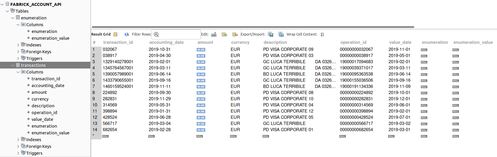

The app exposes 3 endpoints:

1. Endpoint to retrieve account balance: GET http://localhost:8080/account/{{accountId}}
2. Endpoint to perform money transfer: POST http://localhost:8080/account/{{accountId}}/transfer
3. Endpoint to retrieve list of transactions and save them into the MySQL db: GET http://localhost:8080/account/{{accountId}}/transactions?fromAccountingDate={{yyyy-MM-dd}}&toAccountingDate={{yyyy-MM-dd}}

To test them, you can use the account id 14537780 and the query params fromAccountingDate=2019-01-01, toAccountingDate=2019-12-01.

When a list of transaction is required, the transactions are saved into the MySQL db:

